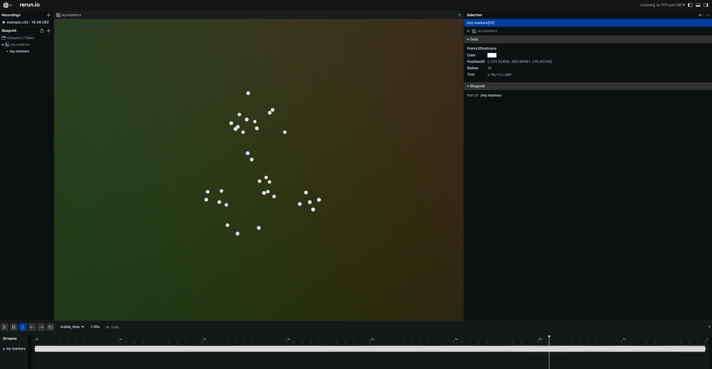

# Pyorerun
We can rerun c3d files and display their original content.
And all also animate biorbd models from the pyomeca organization.

# Installation prerequisites
``` conda install -c conda-forge ezc3d rerun-sdk trimesh numpy biorbd ```

Then, ensure it is accessible in your Python environment by installing the package:

``` pip install . ``` or ``` python setup.py install ```

Conda install will come soon. Don't worry 😊.

~~``` conda install -c conda-forge pyorerun ```~~

# Rerun .c3d - As simple as that

``` python3
from pyorerun import rrc3d

rrc3d("example.c3d")
```

<p align="center">
    
</p>

# NOTE
- Only handle markers for now

# Contributing
Contributions are welcome. I will be happy to review and help you to improve the code.

