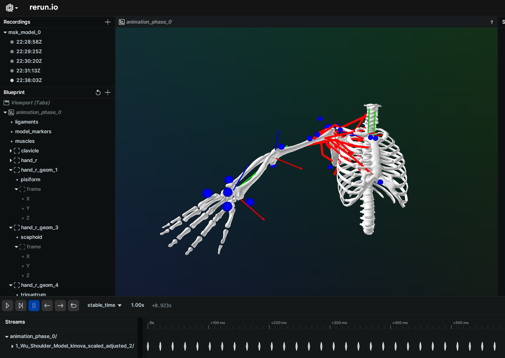

# Pyorerun
[](https://codeclimate.com/github/pyomeca/pyorerun/maintainability)

We can rerun c3d files and display their original content.
And all also animate biorbd models from the pyomeca organization.

# Installation prerequisites
``` conda install -c conda-forge ezc3d rerun-sdk trimesh numpy biorbd pyomeca ```

Then, ensure it is accessible in your Python environment by installing the package:

``` pip install . ``` or ``` python setup.py install ```

Conda install will come soon. Don't worry 😊.

~~``` conda install -c conda-forge pyorerun ```~~

# Rerun .c3d - As simple as that

``` python3
import pyorerun as prr

prr.c3d("example.c3d")
```

<p align="center">
    
</p>

**NOTE**: Only handle markers for now

# Rerun biorbd Models

``` python3
from pyorerun import BiorbdModel, PhaseRerun

nb_frames = 10
nb_seconds = 0.1
t_span = np.linspace(0, nb_seconds, nb_frames)

model = BiorbdModel("models/Wu_Shoulder_Model_kinova_scaled_adjusted_2.bioMod")
q = np.zeros((model.model.nbQ(), nb_frames))

viz = PhaseRerun(t_span)
viz.add_animated_model(model, q)
viz.rerun("msk_model")
```

<p align="center">
    
</p>

# play with joint DoFs q
``` python3
from pyorerun import LiveModelAnimation


model_path = "models/Wu_Shoulder_Model_kinova_scaled_adjusted_2.bioMod"
animation = LiveModelAnimation(model_path, with_q_charts=True)
animation.rerun()
```

# Contributing
Contributions are welcome. I will be happy to review and help you to improve the code.

